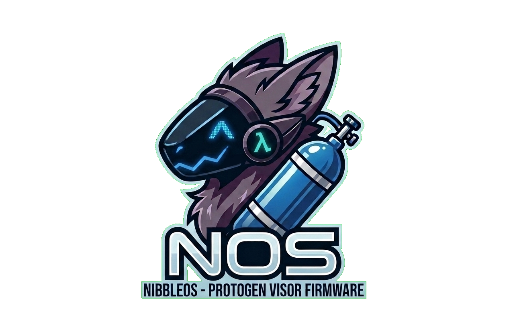
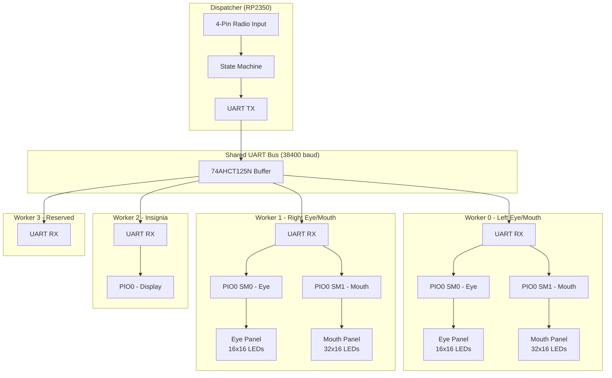
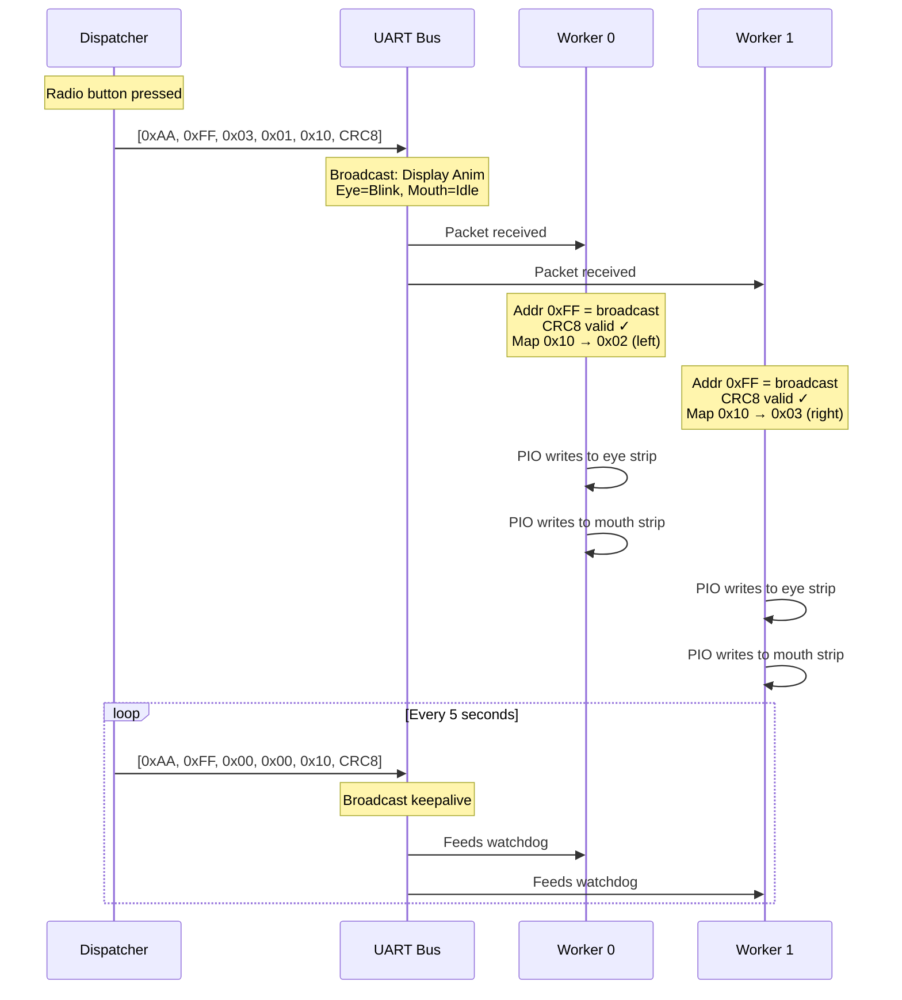

# NOS



**N**itrous **O**xide / **N**ibble**OS** - Firmware for Nibble the protogen.

## Architecture

NOS uses a distributed master-worker architecture with 5 RP2350 (Pico 2) microcontrollers communicating over a shared UART bus.



### Components

| Component | Role | Address |
|-----------|------|---------|
| Dispatcher | Master controller, handles radio input, sends animation commands | `0x00` |
| Worker 0 | Left eye (GP18) + left mouth (GP12) | `0x01` |
| Worker 1 | Right eye (GP18) + right mouth (GP12) | `0x02` |
| Worker 2 | Insignia display | `0x03` |
| Worker 3 | Reserved for future use | `0x04` |
| Broadcast | All workers respond | `0xFF` |

### Communication Flow



## Protocol

### Packet Format (6 bytes)

| Byte | Field | Description |
|------|-------|-------------|
| 0 | Header | Always `0xAA` |
| 1 | Address | Target worker (`0x01`-`0x04`) or broadcast (`0xFF`) |
| 2 | Command | `0x00`=NoOp, `0x01`=LedOn, `0x02`=LedOff, `0x03`=DisplayAnim |
| 3 | Eye Anim | Animation ID for eye panel |
| 4 | Mouth Anim | Animation ID for mouth panel |
| 5 | Checksum | CRC-8/MAXIM of bytes 1-4 |

### CRC-8/MAXIM

- Polynomial: `0x31`
- Initial value: `0x00`
- No reflection, no XOR out
- Example: `CRC8([0x01, 0x03, 0x00, 0x10]) = 0x12`

### Protocol Hardening

- **Inter-byte timeout**: Buffer resets if >20ms between bytes (handles partial packets)
- **Broadcast address**: `0xFF` reaches all workers with single packet
- **Watchdog**: 5-second timeout per worker, fed by keepalive packets

## WS2812 LED Driver

Workers use **PIO-based WS2812** instead of software bit-banging. This prevents UART RX interrupts from disrupting LED timing.

| Feature | Bit-banged (old) | PIO-based (current) |
|---------|------------------|---------------------|
| Timing source | CPU cycles | PIO state machine |
| Interrupt immune | No | Yes |
| DMA support | No | Yes |
| Reset pulse | Manual 300µs delay | Automatic |

Each worker uses two PIO state machines from PIO0:
- **SM0**: Eye strip (256 LEDs on GP18)
- **SM1**: Mouth strip (512 LEDs on GP12)

## Requirements

- [TinyGo](https://tinygo.org/) - Go compiler for embedded systems
- [Task](https://taskfile.dev/) - Task runner
- Python 3 with `pyyaml` and `rich`

## Tasks

Run tasks with `task <task-name>`. Use `task --list` to see all available tasks.

### Firmware

| Task | Description |
|------|-------------|
| `build:dispatcher` | Build dispatcher firmware |
| `build:worker-0` | Build worker-0 firmware |
| `build:worker-1` | Build worker-1 firmware |
| `build:worker-2` | Build worker-2 firmware |
| `build:worker-3` | Build worker-3 firmware |
| `build:all` | Build all firmwares |
| `flash:dispatcher` | Flash dispatcher firmware (with monitor) |
| `flash:worker-0` | Flash worker-0 firmware (with monitor) |
| `flash:worker-1` | Flash worker-1 firmware (with monitor) |
| `flash:worker-2` | Flash worker-2 firmware (with monitor) |
| `flash:worker-3` | Flash worker-3 firmware (with monitor) |
| `monitor` | Attach serial monitor to connected Pico |

### Animations

| Task | Description |
|------|-------------|
| `compile_anims` | Compile animations from `anims.yaml` to `.animbyte` files |
| `generate_embeds` | Update `main.go` and `cmd/structs.go` from `anims.yaml` |
| `update_anims` | Run both: compile animations and update embeds |

## Animation Pipeline

Animations are configured in `anims.yaml` and compiled to binary format for embedding in the firmware.

### Configuration (`anims.yaml`)

```yaml
animations:
  - name: eye_idle         # Output filename (eye_idle.animbyte)
    id: 0x00               # Protocol ID (see Animation IDs below)
    source: eye_idle.anim  # Source folder in compiler/animations/
    type: eye              # Frame dimensions: "eye" or "mouth"
    embed: true            # Include in firmware (false for logical animations)
    rotation: 0            # 0, 90, 180, or 270 degrees
    mirror_x: false        # Horizontal flip (left-right)
    mirror_y: false        # Vertical flip (top-bottom)
    matrix_width: 16       # LED matrix width
    matrix_height: 16      # LED matrix height
    brightness: 0.2        # 0.0 to 1.0
```

### Animation IDs

There are two types of animations:

**Embedded animations** (`embed: true`):
- Compiled and included in firmware
- IDs must be sequential starting from `0x00`
- ID determines position in `LoadedAnimations` array

**Logical animations** (`embed: false`):
- Not compiled, just define a protocol ID
- Can have any unique ID (typically `0x10+`)
- Used with side mapping (see below)

### Side Mapping (Left/Right Workers)

For animations that need mirroring per side (e.g., mouth panels), use logical animations with side variants:

```yaml
# Actual animations (embedded, with side-specific settings)
- name: mouth_idle_left
  id: 0x02
  logical_id: 0x10        # Maps from Anim_MouthIdle
  side: left              # Worker_0 uses this
  source: mouth_idle.anim
  embed: true
  mirror_x: false         # Original orientation
  ...

- name: mouth_idle_right
  id: 0x03
  logical_id: 0x10        # Maps from Anim_MouthIdle
  side: right             # Worker_1 uses this
  source: mouth_idle.anim
  embed: true
  mirror_x: true          # Mirrored for the other side
  ...

# Logical animation (protocol ID only, not embedded)
- name: mouth_idle
  id: 0x10
  embed: false
```

**How it works:**
1. Dispatcher sends `Anim_MouthIdle` (0x10) to both workers
2. Worker_0 (left) translates 0x10 → 0x02 (`Anim_MouthIdleLeft`)
3. Worker_1 (right) translates 0x10 → 0x03 (`Anim_MouthIdleRight`)

The mapping is auto-generated in `cmd/structs.go`:
```go
var animationMapping = map[Address]map[AnimationID]AnimationID{
    Worker_0: {Anim_MouthIdle: Anim_MouthIdleLeft},
    Worker_1: {Anim_MouthIdle: Anim_MouthIdleRight},
}
```

### Workflow

1. Edit `anims.yaml` to add or modify animations
2. Run `task update_anims`
3. Build and flash firmware

### How it works

1. **`compile_anims`** - Runs `helpers/compile_all.py`:
   - Reads `anims.yaml`
   - Compiles each animation using `compiler/compiler/process.py`
   - Outputs `.animbyte` files to `animations/`

2. **`generate_embeds`** - Runs `helpers/generate_embeds.py`:
   - Reads `anims.yaml`
   - Updates `main.go` between marker comments:
     - `// EMBED_START` / `// EMBED_END` - embed directives
     - `// LOAD_START` / `// LOAD_END` - LoadAnimation calls
     - `// APPEND_START` / `// APPEND_END` - LoadedAnimations array
   - Updates `cmd/structs.go` between markers:
     - `// ANIMID_START` / `// ANIMID_END` - AnimationID constants
     - `// MAPPING_START` / `// MAPPING_END` - Side mapping table

### Adding new animations

1. Create animation frames in `compiler/animations/<name>.anim/`
2. Add entry to `anims.yaml`:
   - For simple animations: use next sequential embedded ID
   - For left/right variants: create both variants + a logical animation
3. Run `task update_anims`
