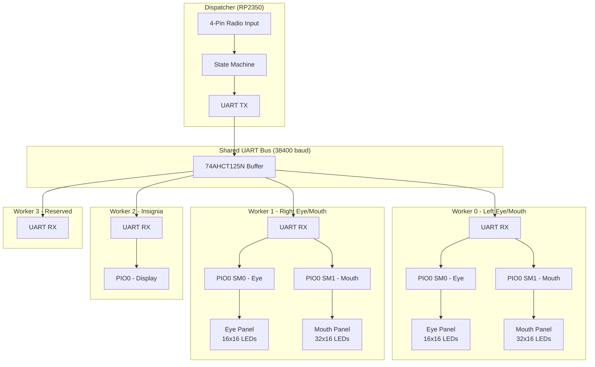

# NOS


**N**itrous **O**xide / **N**ibble**OS** - Firmware for Nibble the protogen.

## Architecture

NOS uses a distributed master-worker architecture with 5 RP2350 (Pico 2) microcontrollers communicating over a shared UART bus.



### Components

| Component | Role | Address |
|-----------|------|---------|
| Dispatcher | Master controller, handles radio input, sends animation commands | `0x00` |
| Worker 0 | Left eye (GP18) + left mouth (GP12) | `0x01` |
| Worker 1 | Right eye (GP18) + right mouth (GP12) | `0x02` |
| Worker 2 | Insignia display | `0x03` |
| Worker 3 | Reserved for future use | `0x04` |
| Broadcast | All workers respond | `0xFF` |

### Communication Flow


## Radio Remote Control

The dispatcher reads a 4-button remote (A/B/C/D) on GP16–GP19. Presses are decoded into control codes.

### Encoding

A single button press sends its index directly (A=0, B=1, C=2, D=3). A double-press (first press → release → second press within 500ms) encodes as:

```
code = 4 + (first << 2 | second)
```

Single-press codes (0–3) are currently unassigned.

### Button Mapping

| Code | Buttons | Action | Description |
|------|---------|--------|-------------|
| 0x04 | A + A | Mouth: Idle | Send idle mouth animation to all workers |
| 0x05 | A + B | Reserved | — |
| 0x06 | A + C | Reserved | — |
| 0x07 | A + D | Reserved | — |
| 0x08 | B + A | Eyes: Idle Blink | Periodic blink cycle (~3s interval, 200ms blink) |
| 0x09 | B + B | Eyes: Happy | Static happy/squint expression |
| 0x0A | B + C | Eyes: Excited | Static excited expression (per-side rotation) |
| 0x0B | B + D | Reserved | — |
| 0x0C | C + A | Reserved | — |
| 0x0D | C + B | Reserved | — |
| 0x0E | C + C | Reserved | — |
| 0x0F | C + D | Reserved | — |
| 0x10 | D + A | Reserved | Planned: insignia mode (code value collides with `Anim_MouthIdle` ID — different namespaces, no conflict) |
| 0x11 | D + B | Reserved | — |
| 0x12 | D + C | Reserved | — |
| 0x13 | D + D | System Reboot | Broadcasts `Cmd_Reboot`, then hard-resets dispatcher |

## Protocol

### Packet Format (6 bytes)

| Byte | Field | Description |
|------|-------|-------------|
| 0 | Header | Always `0xAA` |
| 1 | Address | Target worker (`0x01`–`0x04`) or broadcast (`0xFF`) |
| 2 | Command | See table below |
| 3 | Eye Anim | Animation ID for eye panel |
| 4 | Mouth Anim | Animation ID for mouth panel |
| 5 | Checksum | CRC-8/MAXIM of bytes 1–4 |

### Commands

| Value | Name | Description |
|-------|------|-------------|
| 0x00 | `NoOp` | Keepalive — feeds worker watchdog, no display change |
| 0x01 | `LedOn` | Turn status LED on |
| 0x02 | `LedOff` | Turn status LED off |
| 0x03 | `DisplayAnim` | Set eye and mouth animations |
| 0x04 | `Ping` | Reserved (unused) |
| 0x05 | `Reboot` | Hard-reset the worker |

### CRC-8/MAXIM

- Polynomial: `0x31`
- Initial value: `0x00`
- No reflection, no XOR out
- Example: `CRC8([0x01, 0x03, 0x00, 0x10]) = 0x12`

### Protocol Hardening

- **Inter-byte timeout**: Buffer resets if >20ms between bytes (handles partial packets)
- **Broadcast address**: `0xFF` reaches all workers with single packet
- **Watchdog**: 5-second timeout per worker, fed by keepalive packets every 2 seconds

## Animations

### Embedded Eye Animations

| ID | Name | Frames | Description |
|----|------|--------|-------------|
| 0x00 | `eye_idle` | 1 | Default round eyes |
| 0x01 | `eye_blink` | 50 | Blink cycle |
| 0x04 | `eye_happy` | 1 | Happy/squint expression |
| 0x0B | `eye_excited_left` | 1 | Excited expression (Worker 0) |
| 0x0C | `eye_excited_right` | 1 | Excited expression (Worker 1, different rotation) |

### Embedded Mouth Animations

| ID | Name | Side | Description |
|----|------|------|-------------|
| 0x02 | `mouth_idle_left` | Left | Closed mouth |
| 0x03 | `mouth_idle_right` | Right | Closed mouth (mirrored) |
| 0x05 | `mouth_yap_1_left` | Left | Slightly open |
| 0x06 | `mouth_yap_1_right` | Right | Slightly open (mirrored) |
| 0x07 | `mouth_yap_2_left` | Left | Medium open |
| 0x08 | `mouth_yap_2_right` | Right | Medium open (mirrored) |
| 0x09 | `mouth_yap_3_left` | Left | Wide open |
| 0x0A | `mouth_yap_3_right` | Right | Wide open (mirrored) |

### Logical Animations (Protocol IDs)

The dispatcher sends these IDs; each worker translates them to its side-specific variant via `MapAnimation`.

| ID | Name | Worker 0 (left) | Worker 1 (right) |
|----|------|-----------------|-----------------|
| 0x10 | `mouth_idle` | 0x02 | 0x03 |
| 0x11 | `mouth_yap_1` | 0x05 | 0x06 |
| 0x12 | `mouth_yap_2` | 0x07 | 0x08 |
| 0x13 | `mouth_yap_3` | 0x09 | 0x0A |
| 0x14 | `eye_excited` | 0x0B | 0x0C |

## Animation Transitions

Workers blend between animations using per-pixel smoothstep interpolation. No protocol changes are needed — transitions are handled entirely on the worker side.

- **Eye transitions**: ~250ms (15 frames at ~60fps)
- **Mouth transitions**: ~100ms (6 frames)
- **Multi-frame → static**: waits for the current animation cycle to complete before starting the blend (e.g., `eye_blink` plays all 50 frames before fading to `eye_idle`)
- **Multi-frame target**: immediate hard switch — no blend delay
- **Static → static**: immediate smooth blend
- **Redirect**: if a new target arrives mid-blend, it snapshots the current interpolated frame and blends from there
- **Zero allocation**: snapshot buffers allocated once at init (eye: 768 bytes, mouth: 1536 bytes)

## WS2812 LED Driver

Workers use **PIO-based WS2812** instead of software bit-banging. This prevents UART RX interrupts from disrupting LED timing.

| Feature | Bit-banged (old) | PIO-based (current) |
|---------|------------------|---------------------|
| Timing source | CPU cycles | PIO state machine |
| Interrupt immune | No | Yes |
| DMA support | No | Yes |
| Reset pulse | Manual 300µs delay | Automatic |

Each worker uses two PIO state machines from PIO0:
- **SM0**: Eye strip (256 LEDs on GP18)
- **SM1**: Mouth strip (512 LEDs on GP12)

## Memory Management

The RP2350 has only 520 KB of RAM. To avoid GC-induced freezes, the animation loop uses a **zero-allocation hot path**:

| Component | Strategy |
|-----------|----------|
| Frame buffers | Fixed `[]uint32` allocated once at init (eyeBuffer=1KB, mouthBuffer=2KB) |
| Transition snapshots | Fixed `[]byte` allocated once at init (eye=768B, mouth=1536B) |
| Frame conversion | `bytesToRawInto()` writes directly into fixed buffer, no slice allocation |
| CRC checksums | `Crc8Bytes4()` takes 4 bytes directly, no slice allocation |
| WriteRaw calls | Direct PIO writes, no closure/defer overhead |

### Monitoring

The watchdog goroutine logs heap stats every 30 seconds:
```
[MEM] alloc=12345 totalAlloc=67890 sys=524288
```

- `alloc`: Currently allocated heap bytes (should stay flat in steady state)
- `totalAlloc`: Cumulative bytes allocated (grows slowly = healthy)
- `sys`: Total memory obtained from OS

### Canary Goroutines

Multiple goroutines prove the system is alive:

| Log | Interval | Purpose |
|-----|----------|---------|
| `[WD] alive` | 5s | Watchdog goroutine is running |
| `[ANIM TICK]` | 2s | Animation goroutine is running |
| `[HB]` | 10s | UART loop is running |

If any canary stops ticking, that goroutine has stalled (likely GC or panic).

## TinyGo RP2350 Known Issues

Issues discovered during development on TinyGo with the RP2350 (Pico 2):

**Dual-core scheduler deadlocks under GC pressure**
Using `-scheduler=cores` (the default multi-core scheduler) causes the firmware to deadlock when GC runs concurrently across cores. Fix: use `-scheduler=tasks` in all build commands. This is set in `taskfile.yaml`'s `_build` and `_flash` tasks — do not remove this flag. Reference: [tinygo-org/tinygo#5151](https://github.com/tinygo-org/tinygo/issues/5151).

**Software reset is not functional**
On the RP2350 with current TinyGo:
- `machine.Watchdog.Configure` / `machine.Watchdog.Update` appear to be no-ops — the watchdog does not actually reset the chip
- `machine.CPUReset()` does not reset the chip
- Writing `0x05FA0004` to the AIRCR register (`0xE000ED0C`) does not reset the chip

`HardReset()` in the codebase wraps these attempts. On hardware it does not reliably reset; an external watchdog or manual power cycle is needed for true recovery.

**Embedded data may land in RAM**
`//go:embed` directives may place animation data in RAM rather than flash, limiting available space. Total animation data must stay well under the 520 KB SRAM limit. Large animation sets may require streaming from flash instead.

**ADC peripheral disabled at boot**
`machine.InitADC()` must be called before any `adc.Get()` — it sets `ADC_CS.EN=1`. Without it, `adc.Get()` polls `ADC_CS.READY` forever (the peripheral is disabled at boot). If the ADC is needed in future, call `machine.InitADC()` first and add a diagnostic read to confirm it's not hanging.

## Requirements

- [TinyGo](https://tinygo.org/) - Go compiler for embedded systems
- [Task](https://taskfile.dev/) - Task runner
- Python 3 with `pyyaml` and `rich`

## Tasks

Run tasks with `task <task-name>`. Use `task --list` to see all available tasks.

> **Note:** All firmware builds use `-scheduler=tasks` to work around TinyGo issue [#5151](https://github.com/tinygo-org/tinygo/issues/5151). This flag is set in `taskfile.yaml` and must not be removed.

### Firmware

| Task | Description |
|------|-------------|
| `build:dispatcher` | Build dispatcher firmware |
| `build:worker-0` | Build worker-0 firmware |
| `build:worker-1` | Build worker-1 firmware |
| `build:worker-2` | Build worker-2 firmware |
| `build:worker-3` | Build worker-3 firmware |
| `build:all` | Build all firmwares |
| `flash:dispatcher` | Flash dispatcher firmware (with monitor) |
| `flash:worker-0` | Flash worker-0 firmware (with monitor) |
| `flash:worker-1` | Flash worker-1 firmware (with monitor) |
| `flash:worker-2` | Flash worker-2 firmware (with monitor) |
| `flash:worker-3` | Flash worker-3 firmware (with monitor) |
| `monitor` | Attach serial monitor to connected Pico |

### Development

| Task | Description |
|------|-------------|
| `test` | Run unit tests (`go test ./cmd/`) |
| `update_anims` | Compile animations and regenerate embed code |
| `compile_anims` | Compile `.anim` sources to `.animbyte` files |
| `generate_embeds` | Update `main.go` and `cmd/structs.go` from `anims.yaml` |

## Animation Pipeline

Animations are configured in `anims.yaml` and compiled to binary format for embedding in the firmware.

### Configuration (`anims.yaml`)

```yaml
animations:
  - name: eye_idle         # Output filename (eye_idle.animbyte)
    id: 0x00               # Protocol ID (see Animation IDs above)
    source: eye_idle.anim  # Source folder in compiler/animations/
    type: eye              # Frame dimensions: "eye" or "mouth"
    embed: true            # Include in firmware (false for logical animations)
    rotation: 0            # 0, 90, 180, or 270 degrees
    mirror_x: false        # Horizontal flip (left-right)
    mirror_y: false        # Vertical flip (top-bottom)
    matrix_width: 16       # LED matrix width
    matrix_height: 16      # LED matrix height
    brightness: 0.2        # 0.0 to 1.0
```

### Side Mapping (Left/Right Workers)

For animations that need per-side rotation (eyes) or mirroring (mouth), use logical animations with side variants:

```yaml
# Physical variants (embedded, side-specific)
- name: mouth_idle_left
  id: 0x02
  logical_id: 0x10        # Maps from Anim_MouthIdle
  side: left              # Worker_0 uses this
  source: mouth_idle.anim
  embed: true
  ...

- name: mouth_idle_right
  id: 0x03
  logical_id: 0x10        # Maps from Anim_MouthIdle
  side: right             # Worker_1 uses this
  source: mouth_idle.anim
  embed: true
  mirror_x: true
  ...

# Logical animation (protocol ID only, not embedded)
- name: mouth_idle
  id: 0x10
  embed: false
```

**How it works:**
1. Dispatcher sends logical ID `Anim_MouthIdle` (0x10) to both workers
2. Worker_0 (left) translates 0x10 → 0x02 (`Anim_MouthIdleLeft`)
3. Worker_1 (right) translates 0x10 → 0x03 (`Anim_MouthIdleRight`)

The mapping table in `cmd/structs.go` is auto-generated between `// MAPPING_START` / `// MAPPING_END` markers.

### Workflow

1. Edit `anims.yaml` to add or modify animations
2. Run `task update_anims`
3. Build and flash firmware

### How it works

1. **`compile_anims`** — Runs `helpers/compile_all.py`:
   - Reads `anims.yaml`
   - Compiles each animation using `compiler/compiler/process.py`
   - Outputs `.animbyte` files to `animations/`

2. **`generate_embeds`** — Runs `helpers/generate_embeds.py`:
   - Reads `anims.yaml`
   - Updates `main.go` between marker comments:
     - `// EMBED_START` / `// EMBED_END` — embed directives
     - `// LOAD_START` / `// LOAD_END` — LoadAnimation calls
     - `// APPEND_START` / `// APPEND_END` — LoadedAnimations array
   - Updates `cmd/structs.go` between markers:
     - `// ANIMID_START` / `// ANIMID_END` — AnimationID constants
     - `// MAPPING_START` / `// MAPPING_END` — Side mapping table

### Adding new animations

1. Create animation frames in `compiler/animations/<name>.anim/`
2. Add entry to `anims.yaml`:
   - For simple animations: use next sequential embedded ID
   - For left/right variants: create both variants + a logical animation
3. Run `task update_anims`

# Assets
## NOS Logo
NOS Logo by [korwynze](https://korwynze.carrd.co/)